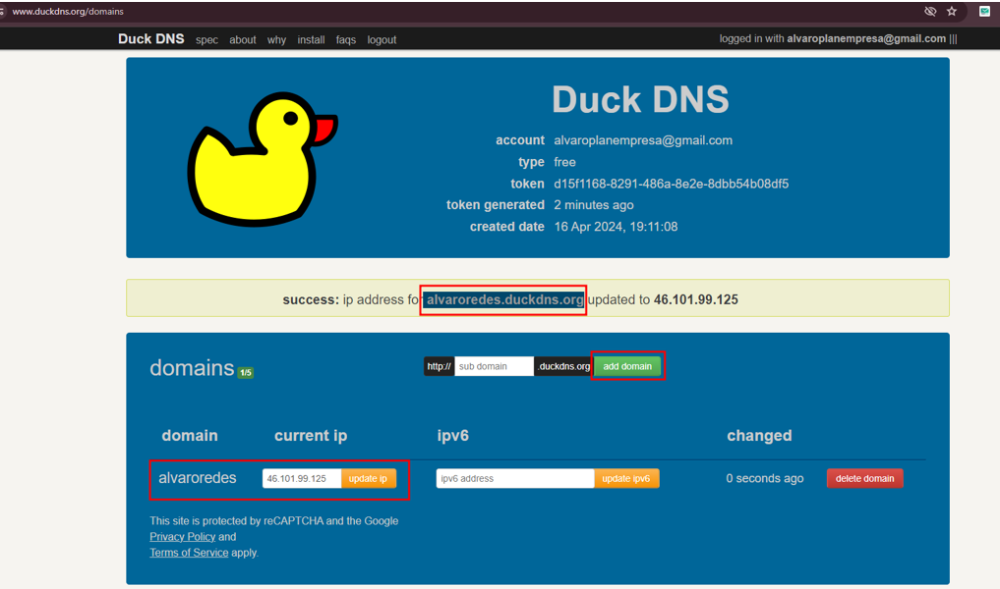
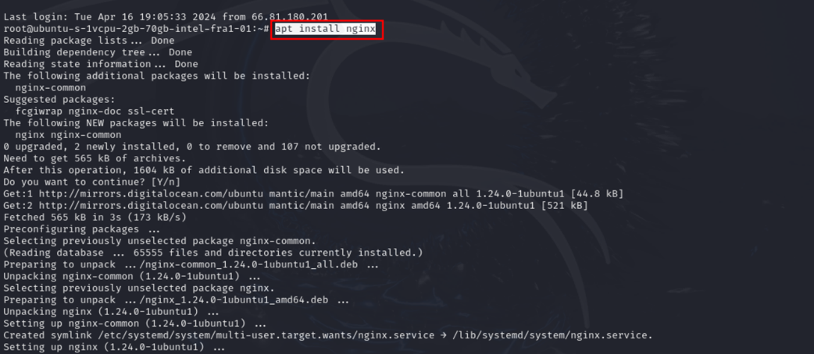
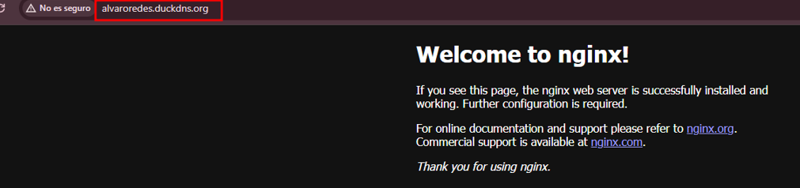
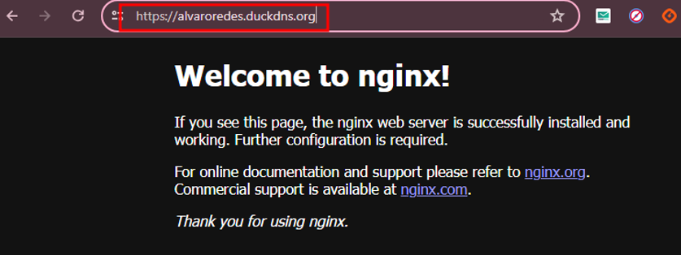
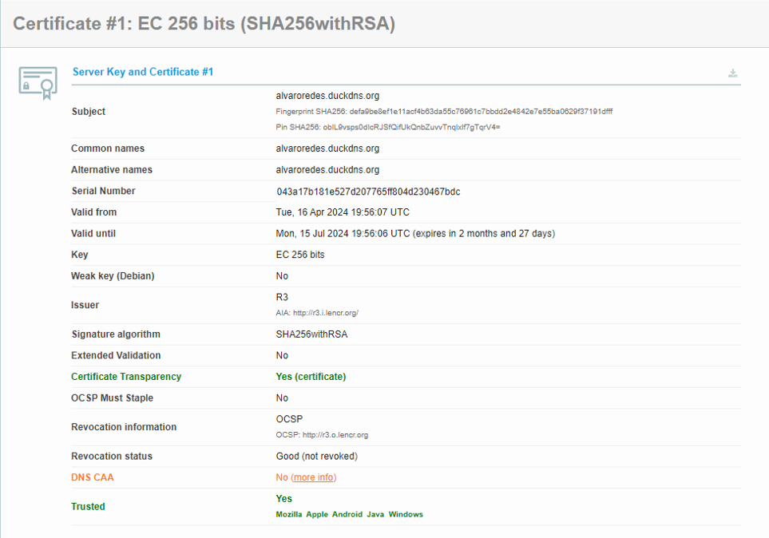
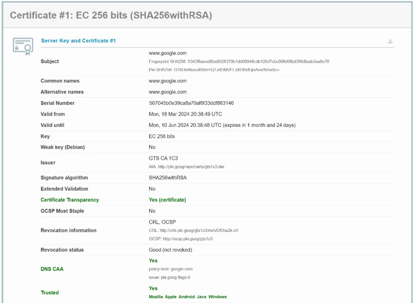

# Parte 2: Vía realista

A continuación, nos vamos a Duck DNS y hacemos un subdominio nuevo y en current IP meteremos la IP de nuestro Ubuntu de DigitalOcean.

Y ahora instalaremos nginx a través de SSH:

Y si nos vamos a la página web ya nos saldrá la página de inicio:

Ahora pondremos el tema de HTTPS, para ello nos vamos a esta guía: <https://certbot.eff.org/instructions?ws=nginx&os=ubuntufocal> y meteremos los comandos que nos dice la página, meteremos 

## Análisis y comparación de diferencias entre certificados:

**Subject:** Cada uno es distinto ya que son dominios distintos, uno es de mi página web y el otro es de Google.

**Fingerprint:** Son distintas, ya que la huella digital SHA256 es única para cada certificado y actúa como un resumen criptográfico del certificado.

**PIN SHA256:** Ambos certificados tienen un "pin" SHA256 único, lo que es una medida de seguridad adicional para prevenir ataques de intermediarios.

**Serial Number**: Cada uno tiene su número de serie distinto e identificativo.

**Validity Period:** alvaroredes.duckdns.org: Válido desde el 16 de abril de 2024 hasta el 15 de julio de 2024.

[www.google.com](http://www.google.com/): Válido desde el 18 de marzo de 2024 hasta el 10 de junio de 2024. Esto indica que el certificado de alvaroredes.duckdns.org tiene un período de validez ligeramente mayor.

**Key:** Ambos tienen la EC 256 bits lo que indica que ambos usan criptografía de curva elíptica de alta seguridad.

**Issuer:** Los certificados fueron emitidos por autoridades certificadoras diferentes, mi sitio web fue emitido por R3 y el de Google fue emitido por GTS CA 1C3.

**Signature algorithm:** Ambos certificados utilizan SHA256 con RSA como algoritmo de firma.

**Extended Validation:** Ambos certificados no tienen validación extendida.

**Certificate Transparency:** Ambos certificados están incluidos en los registros de transparencia del certificado.

**Revocation Information:** Mi sitio web tiene información de revocación disponible a través de OCSP y el de Google tiene información de revocación disponible a través de CRL y OCSP, mostrando un nivel adicional de redundancia.

**DNS CAA:** Mi sitio web no tiene DNS CAA y el de Google si lo tiene.

**Trusted:** Ambos certificados son confiables por los principales navegadores y sistemas operativos.

Estos son los datos de mi certificado, que lo hemos sacado con SSL Labs:

Y esto son los datos de un certificado de Gmail de Google:

