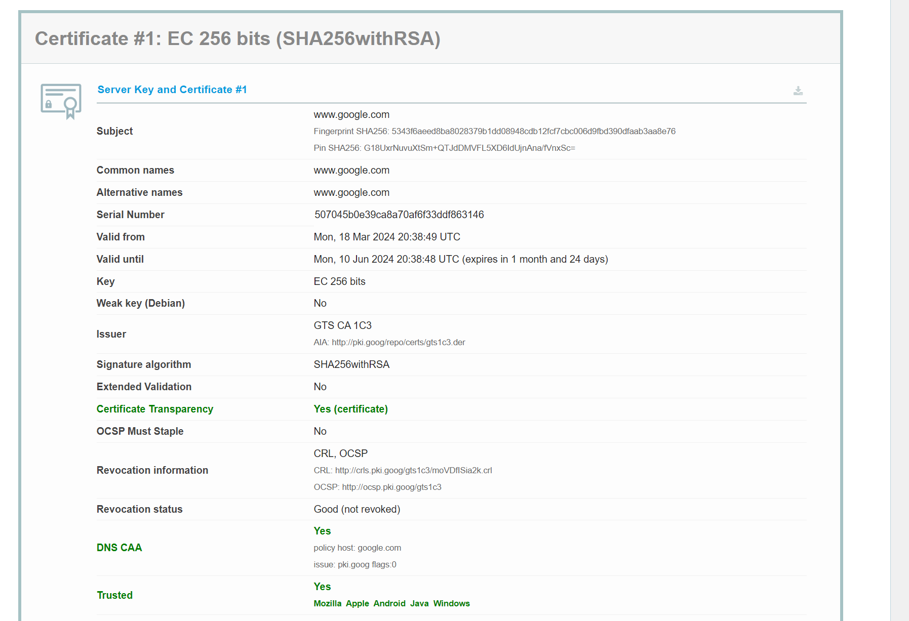
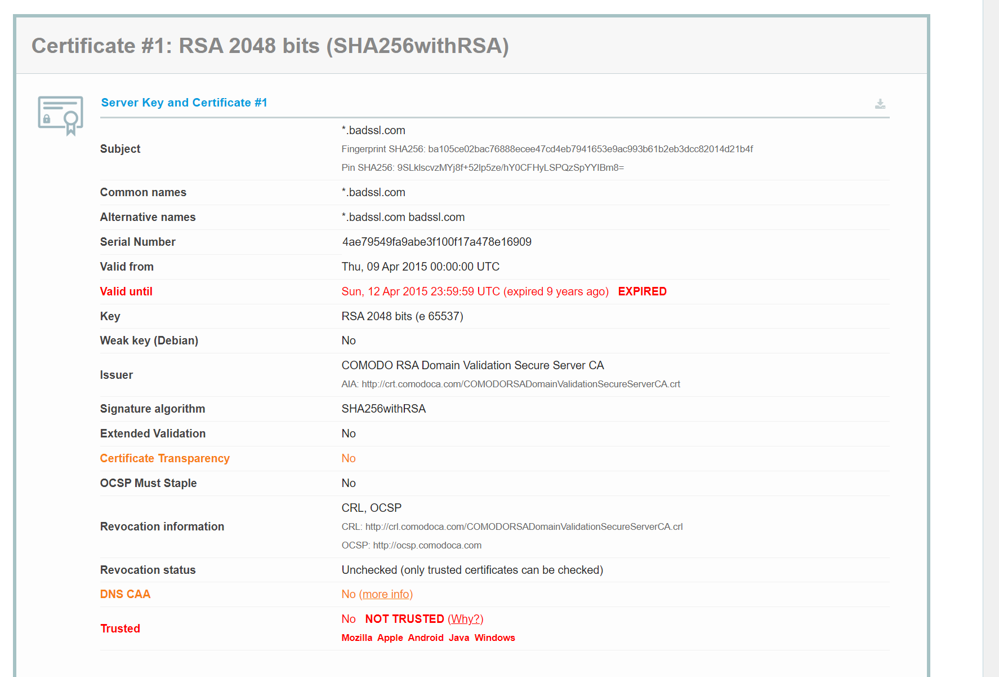
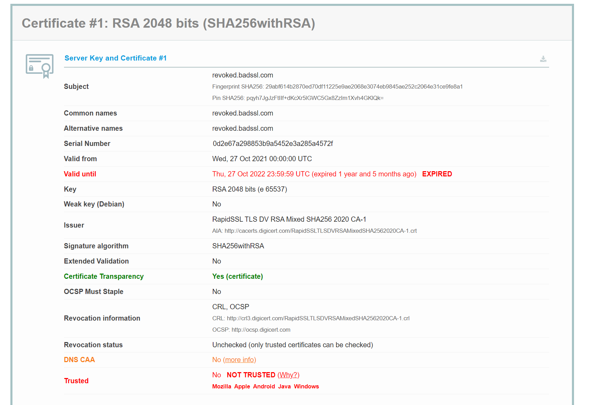
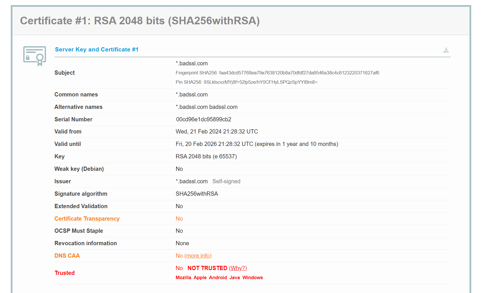

# Parte 3: Vía realista

Ahora analizaremos el certificado válido del sitio web de la parte 2, en este caso es el certificado de la página web de Gmail:

Si vemos las opciones, veremos que el certificado es válido porque:

1. **Emitido por una Autoridad de Certificación (CA) de Confianza**: El certificado fue emitido por "GTS CA 1C3", que parece ser una entidad de confianza. 
1. **Cifrado Fuerte**: Utiliza EC 256 bits, que significa que está utilizando una clave de cifrado de nivel fuerte y que es difícil de romper.
1. **Algoritmo de Firma Seguro**: El algoritmo de firma es SHA256 con RSA, que es actualmente considerado seguro y es ampliamente utilizado para firmar certificados digitales.
1. **Transparencia del Certificado**: Si tiene transparencia del certificado, es decir el certificado está registrado en registros públicos y auditable.
1. **Estado de Revocación**: El estado de revocación es "Bueno (no revocado)", lo que significa que el certificado no ha sido revocado por la CA y sigue siendo de confianza.
1. **Validación de DNS CAA**: Nos indica que, si lo tiene, es decir que el dominio tiene políticas que especifican qué CAs están autorizadas para emitir certificados para el dominio.
1. **Trusted(Confianza)**: El certificado es de confianza en múltiples plataformas (Mozilla, Apple, Android, Java, Windows), lo que indica que las principales plataformas de software confían en la CA que emitió el certificado.

A continuación, elegiremos 3 páginas web con certificados inválidos de distintos tipos, para analizarlo lo haremos con el servicio: <https://www.ssllabs.com/ssltest/>  

Hemos seleccionado estas 3 webs y cada una tiene un problema con sus certificados:

El primer sitio web es: <https://expired.badssl.com/>

1. **Valid Until**: Si nos fijamos en este certificado su validez ya ha expirado hace 9 años.
1. **Certificate Transparency**: Observamos que no tiene habilitado el certificado de transparencia, eso significa que, al registrar cada certificado emitido en un registro público, las entidades y los usuarios no pueden monitorear ni verificar la emisión de certificados.
1. **DNS CAA**: También observamos que le falta el DNS CAA que significa que se tendrá un menor control sobre la emisión de certificados y también en caso de ataques o errores de las CAs, podría ser más fácil para un actor malintencionado obtener un certificado para un dominio sin autorización. 
1. **Trusted**: Por último, si nos dirigimos al apartado de Trusted vemos que no tiene, significa que no ha sido validado por una Autoridad de Certificación (CA) reconocida por el sistema, navegador o dispositivo del usuario que intenta establecer una conexión segura, en este caso es un problema de que el certificado ha sido expirado, los certificados tienen un período de validez, y una vez que expiran, no son considerados confiables hasta que se renuevan.

El segundo sitio web es: <https://revoked.badssl.com/>

1. **Valid Until**: En este certificado podemos observar que no es válido porque su validez expiró hace 1 año y 5 meses.
1. **DNS CAA**: Luego también observamos que el DNS CAA no lo tiene habilitado es decir que se tendrá un menor control sobre la emisión de certificados y también en caso de ataques o errores de las CAs, podría ser más fácil para un actor malintencionado obtener un certificado para un dominio sin autorización. 
1. **Trusted**: Y por último tenemos que el certificado nos dice que está Not Trusted, es decir que no es de confianza ya puede ser por una configuración inválida o un certificado inválido o que la autoridad de certificación sea desconocida.

El tercer sitio web es: <https://self-signed.badssl.com/> 

Y por último tenemos este certificado que está autofirmado y es inválido, ya que necesitamos que una entidad nos certifique este certificado para que sea validado, esto no significa que la página web sea segura.

1. **Certificate Transparency**: Observamos que no tiene habilitado el certificado de transparencia, eso significa que, al registrar cada certificado emitido en un registro público, las entidades y los usuarios no pueden monitorear ni verificar la emisión de certificados.
1. **DNS CAA**: También observamos que le falta el DNS CAA tiene por lo tanto se tendrá un menor control sobre la emisión de certificados y también en caso de ataques o errores de las CAs, podría ser más fácil para un ciberdelincuente obtener un certificado para un dominio sin autorización. 
1. **Trusted**: Por último, tenemos que el certificado nos dice que está Not Trusted, es decir que no es de confianza ya puede ser por una configuración inválida o un certificado inválido o que la autoridad de certificación sea desconocida.

